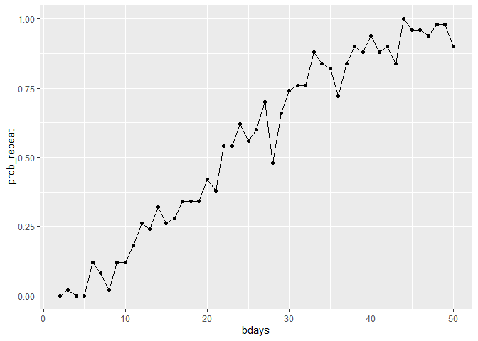
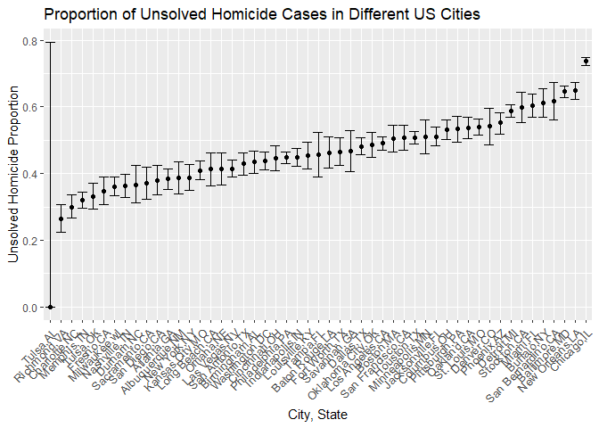

p8105_hw5
================
Maliha Safdar
2025-11-06

``` r
library(tidyverse)
```

    ## ── Attaching core tidyverse packages ──────────────────────── tidyverse 2.0.0 ──
    ## ✔ dplyr     1.1.4     ✔ readr     2.1.5
    ## ✔ forcats   1.0.0     ✔ stringr   1.5.1
    ## ✔ ggplot2   4.0.0     ✔ tibble    3.3.0
    ## ✔ lubridate 1.9.4     ✔ tidyr     1.3.1
    ## ✔ purrr     1.1.0     
    ## ── Conflicts ────────────────────────────────────────── tidyverse_conflicts() ──
    ## ✖ dplyr::filter() masks stats::filter()
    ## ✖ dplyr::lag()    masks stats::lag()
    ## ℹ Use the conflicted package (<http://conflicted.r-lib.org/>) to force all conflicts to become errors

``` r
library(broom)
```

## Problem 1

`In this question we will construct a function for birthdays which will produce a result such that when n number of people are put into a room, at least two people have repeating birthdays. We will know that the result is acheived when we run the bday_sim (birthday simulation) and the result is true.`

``` r
bday_sim = function(n_room) {
  
  birthdays = sample( 1:365, n_room, replace = TRUE) #n_room the no. of people in a room
  
  repeated_bday = length(unique(birthdays)) < n_room # this means that if the length of unique birthdays is less than people in the room, than at least two people have repeated birthdays
  
  repeated_bday
}

bday_sim(50) #running the simulation 20 times. The result was false which means no repeated birthdays yet. When it was repeated 50 times, the result was true because the chance of increases when we increase the number of times people are put into the room and they share sam birthdays. 
```

    ## [1] TRUE

`Next, the function will be run 10000 for groups 2 to 50 (which is number of people that will be put in the room) then, a probability plot will be constructed to show how the probabilty changes as we increase the group size when running the function 10000 times.`

``` r
bday_sim_results = 
  expand.grid(
    bdays = 2:50,
    iter = 1:50
  ) |>
  mutate(
    result = map_lgl(bdays, bday_sim)
  ) |>
    group_by(
      bdays
    ) |>
  summarize(
    prob_repeat = mean(result)
  )


bday_sim_results |>
  ggplot(aes(x = bdays, y = prob_repeat)) +
  geom_point() +
  geom_line()
```

<!-- -->

`Te probability curve above begins near 0, when n =2 and rises slowly and then increases steeply. At n = 22-23, the probability of having atleast two same birthdays reaches 50%. Therefore, we can conclude that when the number of people that are put in a room increases, the probablity that we have repeated birthdays (of at least two people) increases as well. We should also note that the number of times the function is run also plays a key role in this increase, since we ran it 10000 times.`

### Problem 2

``` r
sim_mean_sd = function( n = 30, mu = 0, sigma = 5) {
  sim_data = tibble (
   x = rnorm(n,mean = mu, sd = sigma)
  )
  
  sim_data |>
    summarize(
      mu_hat = mean(x),
      sigma_hat = sd(x)
    )
}

sim_results_df = expand_grid(
  sample_size = 30,
  iter = 1:5000
) |>
  mutate(
    estimate_df = map( iter, ~sim_mean_sd ( n = sample_size))
    ) |>
  unnest(estimate_df)
```

## Problem 3

``` r
homicide_data = read.csv("homicide-data.csv")
```

Describe the raw data:

``` r
unsolved_homicide_data <- homicide_data |>
  mutate(
    city_state = str_c(city, state, sep = ","),
    unsolved = disposition%in%c("Closed without arrest", "Open/No arrest")
  ) |>
  group_by(city_state) |>
  summarise(
    total_homicides = n(),
    unsolved_homicides = sum(unsolved, na.rm = TRUE))

knitr::kable(head(unsolved_homicide_data, 5))
```

| city_state     | total_homicides | unsolved_homicides |
|:---------------|----------------:|-------------------:|
| Albuquerque,NM |             378 |                146 |
| Atlanta,GA     |             973 |                373 |
| Baltimore,MD   |            2827 |               1825 |
| Baton Rouge,LA |             424 |                196 |
| Birmingham,AL  |             800 |                347 |

`Now we will first find the proportion of unsolved homicides and yje confidence intervals for Baltimore,MD and then for all the cities that are contained within the dataset using prop.test and broom::tidy.`

``` r
baltimore_unsolved_counts <- homicide_data |>
    mutate(
      city_state = str_c(city, ",", state), 
      unsolved = disposition%in%c("Closed without arrest", "Open/No arrest")
    ) |>
    filter(city_state == "Baltimore,MD") |>
    summarise(
      total_homicides = n(),
      unsolved_homicides = sum(unsolved, na.rm = TRUE),
      .groups = "drop"
    )


baltimore_prop_test <- prop.test(
  baltimore_unsolved_counts$unsolved_homicides,
  baltimore_unsolved_counts$total_homicides,
  correct = FALSE
)

baltimore_tidy <- tidy(baltimore_prop_test) #this shows us our estimate proportion and confidence intervals but we need to pull it.

baltimore_result <- baltimore_tidy |>
  select(
    unsolved_homicides_prop = estimate,
    ci_low = conf.low,
    ci_high = conf.high
  )

baltimore_result
```

    ## # A tibble: 1 × 3
    ##   unsolved_homicides_prop ci_low ci_high
    ##                     <dbl>  <dbl>   <dbl>
    ## 1                   0.646  0.628   0.663

``` r
all_cities_prop_ci <- homicide_data |>
  mutate(
    city_state = str_c(city, ",", state), 
      unsolved = disposition%in%c("Closed without arrest", "Open/No arrest")
  
    ) |>
  group_by(city_state) |>
  summarise(
      total_homicides = n(),
      unsolved_homicides = sum(unsolved, na.rm = TRUE),
      .groups = "drop"
  ) |>
  mutate(
    all_cities_result = map2(unsolved_homicides,total_homicides, ~prop.test(.x, .y, correct = FALSE)),
    all_cities_tidy_result = map(all_cities_result, tidy)
  ) |>
  unnest(all_cities_tidy_result) |>
  select(
    city_state,
    unsolved_homicides,
    total_homicides,
    unsolved_homicides_prop = estimate,
    ci_low = conf.low,
    ci_high = conf.high
  )
```

    ## Warning: There was 1 warning in `mutate()`.
    ## ℹ In argument: `all_cities_result = map2(...)`.
    ## Caused by warning in `prop.test()`:
    ## ! Chi-squared approximation may be incorrect

``` r
knitr::kable(head(all_cities_prop_ci, 6))
```

| city_state | unsolved_homicides | total_homicides | unsolved_homicides_prop | ci_low | ci_high |
|:---|---:|---:|---:|---:|---:|
| Albuquerque,NM | 146 | 378 | 0.3862434 | 0.3385390 | 0.4362367 |
| Atlanta,GA | 373 | 973 | 0.3833505 | 0.3533160 | 0.4143023 |
| Baltimore,MD | 1825 | 2827 | 0.6455607 | 0.6277411 | 0.6629852 |
| Baton Rouge,LA | 196 | 424 | 0.4622642 | 0.4153589 | 0.5098471 |
| Birmingham,AL | 347 | 800 | 0.4337500 | 0.3998052 | 0.4683280 |
| Boston,MA | 310 | 614 | 0.5048860 | 0.4654318 | 0.5442795 |

`Now we will create a plot that shows the estimates and CIs for each city.`

``` r
all_cities_plot <- all_cities_prop_ci |>
  arrange(unsolved_homicides_prop) |>
  mutate(city_state = factor(city_state, levels = city_state))

all_cities_plot |>
  ggplot(aes(x = city_state, y = unsolved_homicides_prop)) +
  geom_point() +
  geom_errorbar(aes(ymin = ci_low, ymax = ci_high)) +
  theme(
    axis.text.x = element_text(angle = 45, hjust = 1, size = 10)) +
  labs(
    title = "Proportion of Unsolved Homicide Cases in Different US Cities",
    x = "City, State",
    y = "Unsolved Homicide Proportion"
  )
```

<!-- -->
